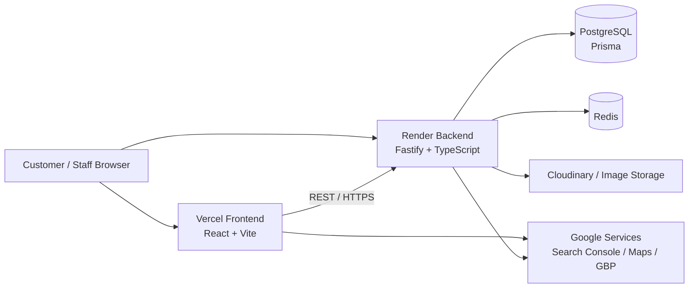

# Wahab Mobiles

Production e-commerce platform for a real mobile-phone retailer in Hyderabad, Sindh, Pakistan.

**Live:** [wahabmobiles.com](https://wahabmobiles.com)

> This is a production business system, not a demo application. Production credentials, customer data, orders, and other sensitive operational information are never committed to this repository.

---

## What This Project Demonstrates

- Full-stack e-commerce for a physical retail business
- Product, variant, inventory, category, and brand management
- Guest and customer shopping flows
- Cart, Buy Now, COD checkout, shipping, order lifecycle, and returns
- Admin / Super Admin separation with tested authorization boundaries
- Security controls covering auth abuse, sessions, CSRF, CORS, and uploads
- Server-rendered SEO metadata, structured data, and sitemap/robots/canonical management
- Automated regression and release verification

---

## Product Scope

- New and used mobile phones and tablets
- Smart watches
- Accessories — screen protectors, chargers, cases/covers, headphones/earbuds, power banks
- Mobile hardware and software repair

The catalogue supports product variants, inventory/stock, prices, conditions, PTA status, product images, and structured metadata across major phone brands (Apple, Samsung, Xiaomi, Google Pixel, realme, OPPO, vivo, Infinix, TECNO, itel, Nokia/HMD, HONOR).

---

## Architecture



| Layer | Technology |
|---|---|
| Frontend | React + Vite, hosted on Vercel |
| Backend API | Fastify + TypeScript, hosted on Render |
| Database | PostgreSQL via Prisma |
| Cache / rate limiting / sessions | Redis |
| Media storage | Cloudinary |

The frontend and API are deployed separately; the frontend consumes the public HTTPS API origin with route-aware raw metadata/rewrite handling for SEO.

---

## Security

Verified in dedicated release gates:

- SQL injection review and dynamic checks — pass
- XSS checks — pass
- IDOR / authorization checks — pass
- Customer → Admin boundary — pass
- Admin → Super Admin boundary — pass
- Session cookies: HttpOnly/Secure production behavior
- Refresh/session rotation and logout invalidation — pass
- Password-change session revocation — pass
- CSRF protection — pass
- Exact-origin CORS policy — pass
- Authenticated upload controls (MIME/signature/size/count/ownership) — pass
- Exposed `.env`, `.git`, source map, and debug-file checks — pass
- Stack-trace / database-error leakage checks — pass
- Account-aware distributed login-abuse protection

**Credential abuse protection:** the account-aware login limiter is Redis-backed, realm-separated, HMAC-based, and normalized by identifier. It supplements existing IP/global limits and was validated against distributed attempts on a single account. Key properties: finite cooldowns, escalation, successful-login reset, realm isolation, and fail-open behavior if Redis is unavailable (without disabling IP/global controls).

---

## Checkout Model

Payment method is **Cash on Delivery**, with a location-based policy:

- **Hyderabad / local orders:** COD available.
- **Orders outside Hyderabad:** placed online, staff confirms with the customer, advance payment collected before dispatch.

| Shipping tier | Cost |
|---|---|
| Standard | PKR 300 |
| Fast | PKR 1,000 |

---

## Authentication

Separate customer and admin authentication realms.

**Customer** — email/password login, registration, refresh/session handling, password reset, profile/password changes, supported social/OAuth flows.

**Staff Admin** — separate admin API realm and login flow, with roles:

| Role | Capabilities |
|---|---|
| `ADMIN` | Dashboard, Products, Orders, Users, Messages, Returns |
| `SUPER_ADMIN` | All of the above + staff/account management |

One user identity is enforced per email address at the account layer — the same email cannot be duplicated across a customer and admin record. Role boundaries are tested directly and via automated regression suites.

---

## SEO Architecture

Shared route/metadata architecture rather than client-side-only title updates.

- Page-specific raw/server metadata, canonical URLs, robots directives
- Sitemap generation, robots.txt, legacy redirects
- Structured data: breadcrumb, Product/ProductGroup schema, variant relationships
- `LocalBusiness`/`MobilePhoneStore` structured data for local landing pages
- Raw-vs-rendered metadata regression tests
- Commercial landing-page indexability rules; search/filter utility routes kept non-indexable

---

## Local Development

Verify the exact local setup against the current repository files before running commands. At a high level:

1. Install Node.js dependencies for `app/` and `app/backend/`.
2. Configure local environment files from the committed `.env.example` templates.
3. Start disposable PostgreSQL and Redis via the repository's Docker configuration.
4. Run Prisma generation/validation and migrations.
5. Start the backend.
6. Start the Vite frontend.

Use only disposable/local data for tests. Never point local integration tests at production databases or production Redis.

---

## Screenshots

```markdown

```

---

## License / Contribution Policy

This repository belongs to a real business and is maintained primarily for the Wahab Mobiles platform and technical portfolio. Public visibility does not imply an open contribution process.

**Do not submit changes that:**
- expose private business/customer information
- weaken authentication or authorization
- bypass release gates
- alter production data or pricing
- copy proprietary business content or imagery

For external readers, this repository is primarily a demonstration of engineering, security, full-stack delivery, and production-oriented software practices.
